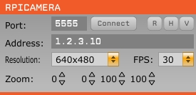

# RPiCamera

A plugin for the [open-ephys plugin-GUI](https://github.com/open-ephys/plugin-GUI/) to control a [Raspberry Pi (RPi)](https://www.raspberrypi.org/) camera over network. The camera is controlled locally on the RPi and communication between the recording system and the RPi is done via [zeromq](http://zeromq.org/). The system has successfully been tested with RPi versions 2 and 3 (model B) and the following camera modules:

-   [Camera Module V2](https://www.raspberrypi.org/products/camera-module-v2/)
-   [Pi NoIR Camera V2](https://www.raspberrypi.org/products/pi-noir-camera-v2/)
-   [RPi Spy Camera](https://www.adafruit.com/product/1937)
-   [Arducam Rev.C OV5647](http://www.arducam.com/raspberry-pi-camera-rev-c-improves-optical-performance/)
-   [Arducam OV5647 NoIR (UC-325 Rev. A)](http://www.arducam.com/raspberry-pi-noir-camera-released/)
-   [Waveshare RPi Camera (F)](https://www.waveshare.com/rpi-camera-f.htm)

The code has been developed to enable detailed behavioral tracking using a head-mounted camera system in freely moving mice. A description and validation of the camera system, including examples demonstrating the power of the new technology in a series of experiments (e.g., eye tracking in freely moving mice), can be found in:

> AF Meyer, J Poort, J O'Keefe, M Sahani, and JF Linden: _A head-mounted camera system integrates detailed behavioral monitoring with multichannel electrophysiology in freely moving mice_, Neuron, Volume 100, p46-60, 2018. [link (open access)](https://doi.org/10.1016/j.neuron.2018.09.020)

## Dependencies

This plugin requires the following libraries:

-   zeromq

It also requires the "rpicamera" Python package (see "Python" folder) to control the camera on the RPi.

## Installation

1.  Install the "rpicamera" Python package (see "Python" folder) on the RPi.

2.  Copy the RPiCamera folder to the plugin folder of your open-ephys plugin-GUI. Then build
    the all plugins as described in the [wiki](https://open-ephys.atlassian.net/wiki/display/OEW/Linux).

## Setting up the Raspberry Pi

1.  Download and install Raspbian as described here:

    -   <https://www.raspberrypi.org/downloads/raspbian/>
    -   <https://www.raspberrypi.org/documentation/installation/installing-images/README.md>

2.  Boot and log into the RPi using the [default password](https://www.raspberrypi.org/documentation/linux/usage/users.md) (and change the password to something more secure)

3.  Set up the network connection.

4.  Enable the camera and ssh via [_raspi-config_](https://www.raspberrypi.org/documentation/configuration/raspi-config.md) on the RPi.

5.  To be able to synchronize video and neural data connect the RPi GPIO to the open-ephys acquisition board. Note that RPiCamera.py uses the board mode (see small numbers in [RPi pinout](<at https://pinout.xyz>)) as this the BCM-based might depend on the PRi version. Connect the the stobe pin and ground (e.g., pin 6 or 9) to the digital inputs of the [open-ephys I/O board](https://open-ephys.atlassian.net/wiki/spaces/OEW/pages/950291/Digital+Analog+I+O). The default strobe pin is 11.

## Running the RPi camera code

Either connect the RPi to a monitor and use the graphical login or log into the RPi via ssh, e.g., _ssh pi@1.2.3.4_ (where pi and 1.2.3.4 are user name and IP address of your RPi, respectively). Then run start the script "rpi_host.py" as described in the rpicamera package.

## Plugin controls

-   **Port:** the zeromq port which must be the same as on the Raspberry Pi (currently fixed to 5555; see file _Python/rpicamera/controller.py_)
-   **Address:** The IP address of the Raspberry Pi (e.g., 1.2.3.10 in the image above)
-   **Connect:** Connect to the Raspberry Pi. This has to be done at the beginning of each recording session.
-   **Resolution:** The camera resolution
-   **FPS:** Frames per second
-   **Zoom:** Sets the zoom applied to the camera's input. The values (left, bottom, width, height) ranging from 0 to 100 indicate the proportion of the image (in percent) to include in the output (aka "Region of Interest").
-   **R:** Reinitialize automatic gain and white level balance. This can be useful if the illuminance changed after starting the "rpi_host.py" script
-   **H:** Enable/disable horizontal image flip
-   **V:** Enable/disable vertical image flip

## How to contribute

Contributions are highly welcome -- either by spotting issues and reporting them and/or by extending the functionality of the plugin. Please use github's issue tracker to report issues and create pull requests for fixes or new features.

## Remarks

### Wrapping h264 files in MP4 container

The RPi code captures video as a raw h264 stream. Some players might have issues with playing it. You can wrap the h264 file into an MP4 container using MP4Box. It's part of the [gpac package](https://gpac.wp.imt.fr/) (`sudo apt install -y gpac`).

For example, for a video file (`video.h264`) recorded with at 60 fps:  
`MP4Box -fps 60 -add video.h264 video.mp4`

### Writing data at fast frame rates

Make sure to use a fast SD card as this is critical when recording camera data at frame rates > ~50 fps (even at 640x480). Moreover, when using high frame rates (> 60 fps) use h264 at slightly lower quality settings (>= 23) as this will reduce the amount of data being written to SD card considerably and avoids dropping frames.

### Disabling the camera LED

To disable the red LED on the RPi camera board you simply need to add the following line to /boot/config.txt:

disable_camera_led=1

### Static IP

You can either set a static IP via the graphical user interface or by editing the file "/etc/dhcpcd.conf", e.g.,

interface eth0
static ip_address=1.2.3.4/24
static routers=1.2.3.1
static domain_name_servers=1.2.3.1

where eth0 is the network interface (here: ethernet), 1.2.3.4 is the static IP of the RPi, and 1.2.3.1 is the router's IP. Save the changes and restart the RPi.

### Disabling the wifi's power saving mode

If you are connecting to the RPi via wifi network make sure to disable the power saving mode which might result in dropouts:

sudo iwconfig wlan0 power off

### Disabling reverse DNS lookups in ssh

Make sure to disable DNS lookup (unless you really need it) as it considerably slows down communication between the recording computer and the RPi. DNS lookup can be disabled by setting "UseDNS no" in /etc/ssh/sshd_config.
